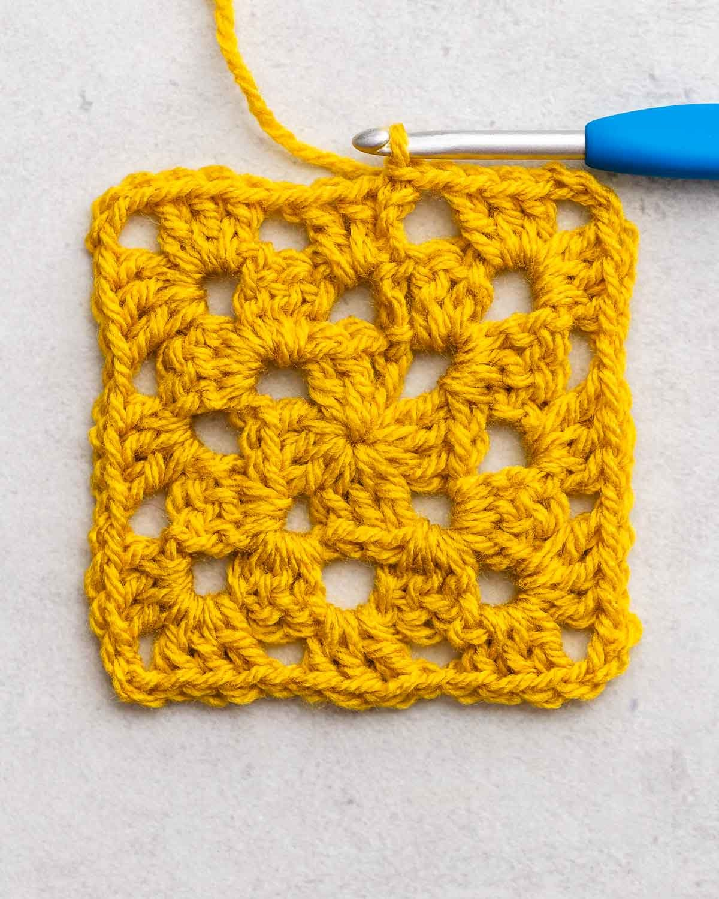

# How to change colours

This how-to guide describes how to change yarn colours for each row.

{ width="500" }

_A three-row granny square, with a different colour for each row.  **Image source**: [Sarah Maker](https://sarahmaker.com/crochet-a-granny-square/)_

## Before you start

This guide assumes that you already know the following:

* US crochet terminology (see Granny square glossary)  
* How to make a crochet granny square  
* How to fasten off with an [invisible finish](https://www.cillacrochets.com/crochet-tutorials/invisible-finish-crochet)

## Add a row in a different colour

The simplest way to make each row a different colour is to fasten off the old yarn, and start a new row with a new yarn. 

1. When you reach the end of your row, complete the final slip-stitch, then cut your yarn and use an invisible finish.  
2. To join a new row, either:   
   1. Slip-stitch the new yarn into any empty space and chain 3 (counts as a double crochet), OR  
   2. Make a [standing double crochet](https://www.mooglyblog.com/standing-double-crochet-joining/) into any empty space  
3. Complete the granny cluster, then continue working the granny square row as normal.  
4. Complete the row, and weave in any yarn ends.  
5. Repeat these steps as many times as needed. 
